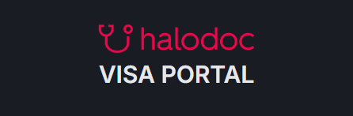
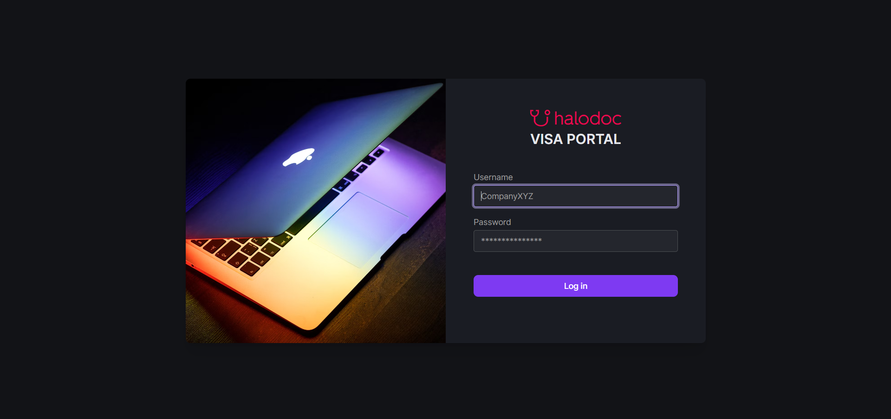
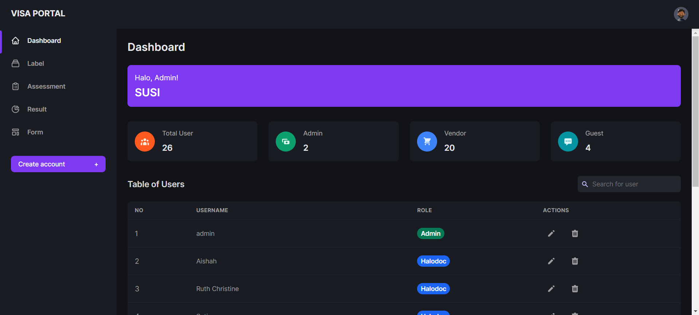
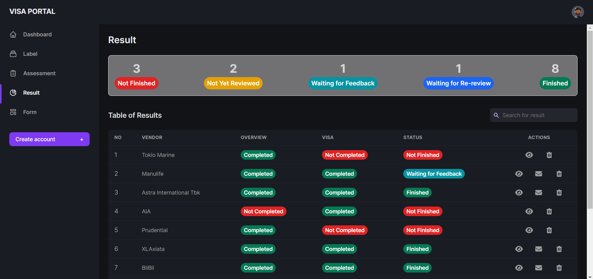
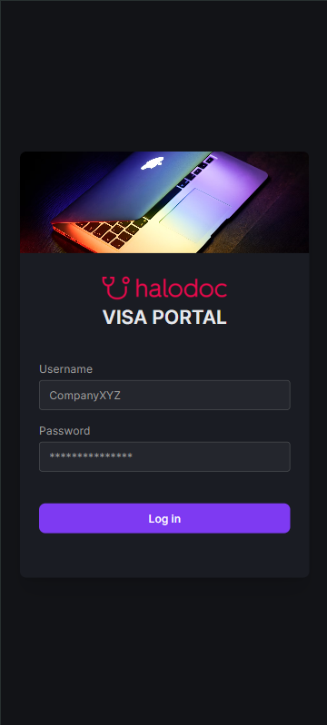
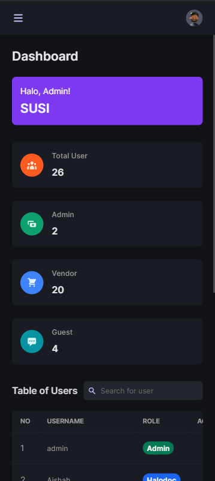
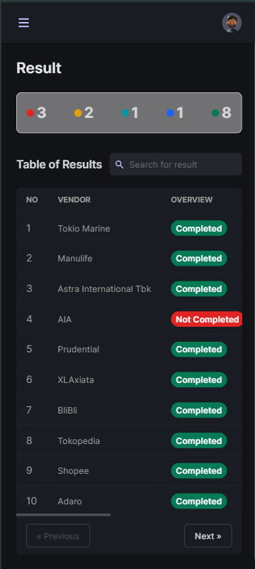

  

## ✨ Project Descriptions 

 The VISA (Vendor Information Security Assessment) Portal represents an evolution of Companiy's existing assessment system, designed to provide a more comprehensive and efficient evaluation process. This application was created using the Laravel Framework with a MySQL database. This project is part of the results of my internship at Halodoc. My role in this project is Full Stack Developer. 
 

## 👧 User Requirements 

 There are three system users, including admin, vendor, and guest.
 

A. **Admin: GRC Lead**
1. Admin can log into the system.
2. Admin can change password.
3. Admin can create, update, and delete vendor users.
4. Admin can create, update, and delete guest users (internal).
5. Admin can create, update, and delete question labels.
6. Admin can create, update, and delete assessment questions.
7. Admin can send notifications to vendor emails via the system.
8. Admin can view vendor assessment results.
9. Admin can provide comments.
10. Admin can finalize vendor assessments.
11. Admin can download vendor assessment results.

B. **Vendor: Third parties**
1. Vendor can log into the system.
2. Vendor can change password.
3. Vendor can complete assessments.
4. Vendor can provide feedback.

C. **Guest: Internal**
1. Guest can log into the system.
2. Guest can change password.
3. Guest can view vendor assessment results.
4. Guest can download vendor assessment results.

## 👩‍💻 System Development

Tools used in creating the system include:

A. **Development environtment:** Laragon is used to provides a local development environment.

B. **IDE:** Visual Studio Code is code editor with extensive development features.

C. **Database:**
  - MySQL is used a relational database management system.
  - DBeaver is used to database management tool and SQL client.

D. **Web Framework:** Laravel is PHP web framework for web application development.

E. **CSS Framework:** Tailwind is utility-first CSS framework for custom designs.

F. **Javascript Framework:** Alpine.js is lightweight JavaScript framework for interactivity.

G. **Web Server:** Nginx is high-performance web server and reverse proxy server.

H. **Design tool:** Figma is used for system design such as user interface (UI) and wireframes. (wareframe link)

## ✍️ Documentation

A. Desktop
1. Login

2. Dashboard

3. Result

B. Mobile
1. Login

2. Dashboard

3. Result

